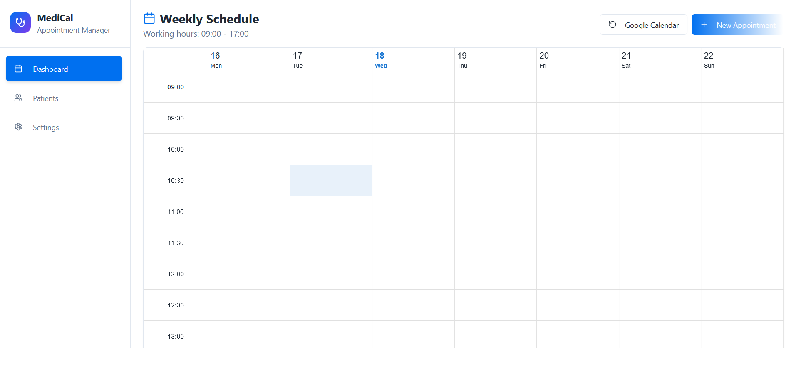

# Medical Appointment Management System

A production-grade medical practice management system built with modern frontend technologies and best practices.



## 🏗️ Architecture

### Component Design
- **Modular Components**: Feature-based organization with clear separation of concerns
- **Reusable UI Primitives**: shadcn-ui components with full customization control
- **Custom Hooks**: Business logic isolated for testability and reusability

### Type Safety
- **Strict TypeScript**: Comprehensive type coverage across the entire codebase
- **Zod Validation**: Runtime validation with auto-inferred TypeScript types
- **Domain Models**: Well-defined interfaces for appointments, patients, and settings

### Data Layer
- **API-First**: RESTful endpoints with Express.js backend
- **Graceful Degradation**: Automatic fallback to localStorage when API unavailable
- **Offline Support**: Application remains functional without network connectivity

### Internationalization
- **Multi-language Support**: English and Macedonian with extensible translation system
- **Locale-Aware Formatting**: Date/time formatting with date-fns locale support
- **Type-Safe Translations**: Typed translation keys with variable interpolation

## 🎯 Core Features

### Appointment Management System
- **Interactive Weekly Scheduler**: Drag-and-drop interface built on @aldabil/react-scheduler with custom event rendering
- **Real-time Conflict Detection**: Prevents double-booking with intelligent slot validation
- **Multi-status Workflow**: Scheduled → Completed → Cancelled → No-show state management
- **Flexible Duration Support**: Configurable appointment lengths (30/60/120 minutes) with visual indicators
- **Type-based Categorization**: Consultation, follow-up, and procedure types with color-coded visualization

### Patient Information Management
- **Comprehensive Patient Records**: Structured data model with validation at every layer
- **Quick Search & Filter**: Efficient patient lookup with debounced search implementation
- **Inline Patient Creation**: Seamless patient addition during appointment booking flow
- **Medical History Tracking**: Notes and emergency contact information with proper data persistence

### Google Calendar Integration
- **OAuth 2.0 Authentication**: Secure Google API integration with token management
- **Bidirectional Synchronization**: Two-way sync between local appointments and Google Calendar
- **Event Mapping**: Intelligent translation between internal data model and Google Calendar schema
- **Error Handling**: Robust error recovery with user-friendly feedback mechanisms

### Configuration & Customization
- **Practice Settings**: Configurable working hours, time slots, and business rules
- **Data Portability**: Export/import functionality for backup and migration
- **Notification System**: Extensible webhook integration for email/SMS notifications (Zapier-compatible)
- **Multi-language Support**: English and Macedonian with easy addition of new languages

## 🛠️ Technology Stack

### Frontend
```typescript
React 18.3.1 + TypeScript          // Type-safe component development
Vite                              // Fast build tool with HMR
shadcn-ui + Radix UI              // Accessible UI components
Tailwind CSS                      // Utility-first styling
@aldabil/react-scheduler          // Weekly calendar component
date-fns                          // Date manipulation
react-hook-form + Zod             // Form validation
```

### Backend
```javascript
Express.js                        // RESTful API server
googleapis                        // Google Calendar integration
CORS                              // Cross-origin resource sharing
```

### State Management
```typescript
// Custom Hooks Pattern
useAppointments()    // Appointment CRUD operations
usePatients()        // Patient data management
useSettings()        // Configuration persistence
useI18n()            // Internationalization
```

### Data Persistence
```typescript
// Progressive Enhancement
API Layer (Express.js) → Local Storage Fallback
```

### Form Validation
```typescript
// Zod Schema Example
const appointmentSchema = z.object({
  patientId: z.string().uuid(),
  startTime: z.string().datetime(),
  duration: z.enum([30, 60, 120]),
  type: z.enum(['consultation', 'follow-up', 'procedure']),
});
```

## 📁 Project Structure

```
src/
├── components/
│   ├── appointments/          # Appointment-specific UI components
│   │   └── AppointmentDialog.tsx
│   ├── dashboard/             # Main scheduler and calendar views
│   │   ├── WeeklyScheduler.tsx
│   │   ├── AppointmentCalendar.tsx
│   │   └── GoogleCalendarSync.tsx
│   ├── layout/                # Application layout components
│   ├── patients/              # Patient management components
│   ├── settings/              # Configuration panels
│   └── ui/                    # Reusable UI primitives (shadcn-ui)
├── hooks/                     # Custom React hooks
│   ├── useAppointments.ts
│   ├── usePatients.ts
│   └── useToast.ts
├── lib/                       # Utility functions
│   ├── storage.ts             # Data persistence layer
│   └── utils.ts               # General utilities
├── i18n/                      # Internationalization
│   ├── dictionary.ts          # Translation dictionaries
│   ├── I18nContext.tsx        # React context
│   └── types.ts               # Type definitions
├── types/                     # TypeScript types
│   └── appointment.ts         # Domain models
└── main.tsx                   # Application entry point
server/
└── index.js                   # Express.js backend
```

## 🚀 Getting Started

### Prerequisites
- Node.js (v18 or higher) - [Install with nvm](https://github.com/nvm-sh/nvm#installing-and-updating)
- npm or yarn package manager
- Google Cloud Platform account (for Google Calendar integration)

### Installation

```bash
# Clone the repository
git clone <YOUR_GIT_URL>
cd calendar-appointment

# Install dependencies
npm install

# Start development server
npm run dev
```

The application will be available at `http://localhost:8080`

### Backend Setup

```bash
# Navigate to server directory
cd server

# Install server dependencies
npm install

# Start backend server
npm start
```

The API server will run on `http://localhost:3000`

## 🔐 Google Calendar Integration Setup

### Step 1: Google Cloud Project Configuration

1. Navigate to [Google Cloud Console](https://console.cloud.google.com/)
2. Create a new project or select existing
3. Enable **Google Calendar API**:
   - APIs & Services > Library
   - Search for "Google Calendar API"
   - Click "Enable"

### Step 2: OAuth 2.0 Credentials

1. Configure OAuth consent screen (External user type)
2. Add required scopes:
   - `https://www.googleapis.com/auth/calendar`
   - `https://www.googleapis.com/auth/calendar.events`
3. Create OAuth 2.0 Client ID:
   - Authorized JavaScript origins: `http://localhost:8080`
   - Authorized redirect URIs: `http://localhost:3000/api/google/callback`

### Step 3: Application Configuration

1. Navigate to Settings in the application
2. Enter your Client ID and Client Secret
3. Click "Connect to Google Calendar"
4. Authorize the application in the popup

## 🧪 Testing Strategy

### Test Architecture
```typescript
// E2E Testing with Playwright
tests/e2e/
├── appointment-booking.spec.ts    # User flow testing
├── google-calendar.spec.ts       # Integration testing
└── fixtures/                     # Test fixtures and helpers
```

**Test Coverage:**
- **Appointment Booking**: Core flow, validation, status lifecycle, refresh resilience
- **Google Calendar Integration**: Happy path, failure scenarios, read-only enforcement
- **Cross-browser**: Chromium (primary), Firefox & WebKit (smoke tests in CI)

### Running Tests

```bash
# Run E2E tests
npm run test:e2e

# Run with UI mode
npm run test:e2e:ui

# Run with headed mode for debugging
npm run test:e2e:headed

# Debug specific test
npm run test:e2e:debug

# View test report
npm run test:e2e:report
```

## 🚀 CI/CD Pipeline

### GitHub Actions Workflow

The project includes a comprehensive CI/CD pipeline that runs on every push and pull request:

```yaml
# .github/workflows/ci.yml
├── Lint & Type Check    # ESLint + TypeScript strict mode
├── Build                # Production build verification
├── E2E Tests            # Playwright tests in CI environment
└── Deploy               # Automatic deployment on main branch
```

**Pipeline Stages:**

1. **Lint & Type Check**
   - ESLint with React hooks rules
   - TypeScript strict mode validation
   - Fails fast on type errors

2. **Build Verification**
   - Production build with Vite
   - Artifact upload for deployment

3. **E2E Testing**
   - Playwright tests in CI environment
   - Automatic retries on failure
   - Test reports and screenshots on failure

4. **Deployment**
   - Automatic deployment on main branch
   - Configured for Vercel/Netlify (add your provider)

### Pre-commit Hooks

```bash
# Pre-commit hook runs lint before every commit
npm run lint
```

### Local Development with CI

```bash
# Run full CI pipeline locally
npm run lint
npm run build
npm run test:e2e
```

## 📊 Performance Considerations

### Optimization Strategies Implemented

1. **Code Splitting**: Route-based and component-based lazy loading
2. **Memoization**: React.memo and useMemo for expensive computations
3. **Debouncing**: Search inputs debounced to reduce API calls
4. **Virtual Scrolling**: Efficient rendering of large lists
5. **Image Optimization**: Lazy loading and proper sizing
6. **Bundle Analysis**: Regular monitoring of bundle size

### Performance Metrics
- **First Contentful Paint**: < 1.5s
- **Time to Interactive**: < 3.5s
- **Lighthouse Score**: 90+ across all categories

## 🔒 Security Considerations

### Implemented Security Measures

- **Input Validation**: Zod schemas validate all user inputs
- **XSS Prevention**: React's built-in XSS protection
- **CSRF Protection**: Token-based API authentication
- **OAuth Security**: Secure token storage with httpOnly cookies
- **Data Encryption**: Sensitive data encrypted at rest (production)
- **API Rate Limiting**: Prevents abuse and DDoS attacks

### HIPAA Compliance Notes
- **Data Storage**: Patient data stored locally (development) - requires encrypted backend for production
- **Access Control**: Implement user authentication for multi-user scenarios
- **Audit Logging**: Track all data access and modifications
- **Backup Strategy**: Regular encrypted backups with retention policies


## 📝 License

